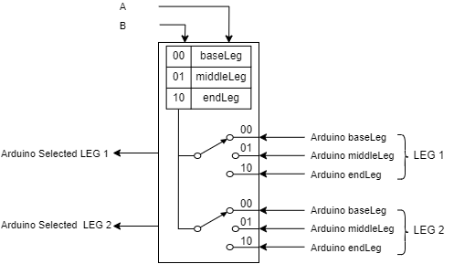

# PinOut Nucleo
|Leg 1|baseLeg |PWM|PB_7|face GND|PWM 4/2|Serial1 RX|I2C1 SDA| |
|:---:|:---:|:---:|:---:|:---:|:---:|:---:|:---:|:---:|
| | |DIR 1 |PC_14|face sous Vin| | | | |
| | |DIR 2|PC_15|face A0| | | | |
| | |trigMaxMin|PH_0|face A1| | | | |
| |middleLeg|PWM|PB_0|A3|PWM 3/3|Analog In| | |
| | |DIR 1 |PC_2|face A4|SPI2 MISO|Analog In| | |
| | |DIR 2|PC_3|face A5|SPI2 MOSI|Analog In| | |
| | |trigMaxMin|PC_1|A4|Serial1 TX|I2C3 SDA|AnalogIn| |
| |endLeg|PWM|PA_15|face 5V|PWM 2/1|SPI1 SSEL| | |
| | |DIR 1 |PA_14|face 3,3V| | | | |
| | |DIR 2|PA_13|face RST| | | | |
| | |trigMaxMin|PC_12|connect gauche, avant dernier haut gauche |Serial5 TX|SPI3 MOSI| | |
|Leg 2|baseLeg |PWM|PC_9|haut gauche connecteur droit|PWM 8/4| | | |
| | |DIR 1 |PC_8|haut droit connecteur droit|PWM 8/3| | | |
| | |DIR 2|PC_6|sous PC_8|PWM 8/1| | | |
| | |trigMaxMin|PB_8|avant dernier haut gauche | | | | |
| |middleLeg|PWM|PB_4|D5|PWM 3/1|SPI1 MISO| | |
| | |DIR 1 |PB_5|D4|PWM 3/2|SPI1 MOSI| | |
| | |DIR 2|PB_3|D3|PWM 2/2|SPI1 SCLK| | |
| | |trigMaxMin|PB_10|D6|Serial1 RX|Serial3 TX |SPI2 SCLK|I2C2 SCL|
| | endLeg |PWM|PB_15|face D6|PWM 1/3N|SPI2 MOSI| | |
| | |DIR 1 |PB_14|face D5|PWM 1/2N|SPI2 MISO|I2C2 SDA| |
| | |DIR 2|PB_13|face D4|PWM 1/1N|SPI2 SCLK|I2C2 SCL| |
| | |trigMaxMin|PB_12|face D11|SPI2 SEL| | | |
|Mux| |A|PB_1|face D7|PWM 3/4|AnalogIn| | |
| | |B|PB_2|face D8| | | | |
| | |TX Leg 1|PA_10|D2|Serial 1 RX|PWM 1/3| | |
| | |TX Leg 2|PC_5|face D14|Serial 3 RX|Analog In| | |

## Fonctionnement du multiplexeur
Nous utilisons un multiplexeur pour économiser le nombre de ports série des Arduino Nano dans les vérins.

## Fonctionnement d'un contrôleur moteur
Nous utilisons 3 contrôleurs moteurs pour contrôler 6 vérins (_LinearActuator_) donc 2 pattes (_Legs_)  

